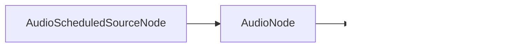

## Web Audio Introduction

##### HS23/24 - HKB - Laurens Inauen

---

### Course Materials

course materials are hosted on [Github](https://github.com/laurens-in/WebAudioIntroduction) to update run `git pull`

---

| | |
|---|---|
|1st half|Contextualizing the browser|
|2nd half|Introduction To Web Audio API|

---

## Contextualizing The Browser

The small picture, the big picture, the bigger picture.

---

> The medium is the message.

_Marshall McLuhan_, 1964

---

https://www.youtube.com/watch?v=UoCrx0scCkM&t=394s

---

What is __a__ medium?

---

__Thesis I__: The medium through which we express our art matters beyond its content.

---

### The Small Picture

The browser in the context of our own artistic practice.

---

__Thesis II__: If certain media allows us to express things that others don’t, then we can also create new forms of art through new media/technologies.

---

__Thesis III__: Thus media can change the way we think about composition.

---

- In our _technical_ introduction it was easy to distinguish between internet/web/browser etc.
- To pinpoint the medium and what it exactly represents is more difficult

---

We are working with the browser, so what _is_ the medium in our case?

What makes it special?

---

The browser:
- represents a **layered** piece of technology (ip -> tcp -> http etc.)
- represents an environment that can execute code
- represents the internet and what it means politically and socially
  - this can mean a lot of things to different people
  - the distinction between browser/web/internet is now secondary

---

- ability to execute generative systems
- ability to subvert everyday technology
- ability to easily distribute pieces
- ability to create intimate interactivity
- ability to create networked, decentralized art works

---

coding in a _non-artistic_ environment presents challenges and opportunities.

---

__Opinion I__: To explore the browser/web/internet meaningfully as artists, it is not enough to merely run Max/MSP inside a browser.

_this doesn't mean that it is never appropriate.__

---

### The Big Picture

The browser as a political medium.

---

What does the browser /web mean politically/socially?

---

The browser/web is a critical piece of technology, it led the way for:
- global information sharing
- social organizing
- surveillance:
  - tracking
  - targeted ads
  - PRISM
  - surveillance capitalism
  - cambridge analytica
- platform capitalism:
  - enshittification
  - technofeudalism

---

![[usage_stats.png]]

source: https://gs.statcounter.com/

---

Is the internet free?

---

- The browser/internet is not some metaphysical entity
- Algorithmic folklore will not help dismantle systems of oppression

We should at least have some understanding of the technology that dominates our lifes. 

---

__Opinion II__: If our web art should bear political meaning, we need to understand the implications of the web as a medium for political messaging.

If we understand how it works we can subvert it, play with it.

---

__Prediction__: The browser will become more important, because it is cheaper to develop web apps than desktop applications. The browser will also become more pervasive.

Google already tried to push this but it didn't catch on, next time might be different.__Prediction__: The browser will become more important, because it is cheaper to develop web apps than desktop applications. The browser will also become more pervasive.

---

> Technology isn't the problem. Stop thinking about what technology does and start thinking about who technology does it to and who it does it for.

_Cory Doctorow, The Internet Con: How To Seize The Means Of Computation_

---

### The Bigger Picture

The browser as a medium in a historical context

---

Let's tgo back in time...

---

![[benjamin.webp]]

---

##### The Work of Art in the Age of Mechanical Reproduction

---

> Even the most perfect reproduction of a work of art is lacking in one element: its presence in time and space, its unique existence at the place where it happens to be. This unique existence of the work of art determined the history to which it was subject throughout the time of its existence.

---

> […] One might subsume the eliminated element in the term “aura” and go on to say: that which withers in the age of mechanical reproduction is the aura of the work of art.

_Walter Benjamin, The Work of Art in the Age of Mechanical Reproduction_

---

authenticity + authority = aura

---

> “What is aura? A peculiar web of space and time: the unique manifestation of a distance, however near it may be. To follow, while reclining on a summer’s noon, the outline of a mountain range on the horizon or a branch, which casts its shadow on the observer until the moment or  the hour partakes of their presence—this is to breathe in the aura of these mountains, of this branch."

_Walter Benjamin, A Short History of Photography_

---

the artwork looses it's aura because:
- authenticity is outside of the sphere of mechanical reproduction (think original/forgery)
- authenticity and authority are dependent on the artworks unique existence in time and space, their embeddednes in tradition

---

- aura was necessary for ritualistic art, the loss of it allows politics to enter into art.
- the social function of art is revolutionized.
- art is democratized.

The tipping point is that reproducible art - which has existed before - becomes mass culture.

---

> [...] neutralizes a number of traditional concepts -- such as creativity and genius, eternal value and mystery -- which, used in an uncontrolled way [...] allow factual material to be manipulated in the interests of fascism.

the structure of auratic art lends itself to fascism.

---

auratic art is not necessarily fascistic, but fascistic art is auratic

---

Then why did reproducible media become a tool for propaganda?

---

It is possible to reintroduce aura into revolutionary media. The new media only holds revolutionary potential, this doesn't mean it is always realized.

---

This is what has happened in many ways:
- star-cult
- new concepts of authenticity (genre-specific)
- DRM
- NFTs

---

What does this have to do with this course?

---

> For the first time ever, the devices people use to listen to music are also capable of executing Generative Music systems.

_Alex Bainter,  creator of generative.fm_

---

##### The Work of Art in the Age of Digital Generability

---

The browser makes it possible for generative art to become mass culture.

The generative work of art is freed from the exhibition space and can enter everyday life.

---

How will it influence:
- authenticity?
- unique existence in time and space?
- aura?
- revolutionary/political potential of art?
- democratization of art?

---

**Opinion III**: The reauratization of generative art is already taking place. 

Think of the way some people talk about AI.

---

##### Footnote

If you want to know more about Benjamin, this lesson is a  good entry point: https://www.youtube.com/watch?v=W1w3ot3JZno

A lot from my short introduction is referencing this lesson.

---

### Poll

---

We have three meetings left, what do we do?

- [ ] Web Audio API? (today)
- [ ] Tone.js?
- [ ] Composing with code?
- [ ] Interaction?
- [ ] Deployment?
- [ ] Build a network (last lesson)?

---

### Web Audio API

---

### What is the Web Audio API?

The Web Audio API is a **Browser API** for playing and manipulating audio, which can incorporate:
- oscillators
- samples
- audio effects
- recording
- user interactions
- visualization

---

### A troubled past...

The Web Audio API is controversial in quite a few ways:
- some people disagree with the spec
- Chrome shipped some of their own spec without [proper review](https://github.com/WebAudio/web-audio-api/issues/248#issuecomment-740698581)
- there are some fundamental problems (scheduling, buffer-size, fft etc.)
	- some limits come from the browser
	- some limits come from the spec
- what is it? [who is it for? ](https://blog.mecheye.net/2017/09/i-dont-know-who-the-web-audio-api-is-designed-for/)

---

### What it isn't...

- collection of audio primitives (no `+`, no `*` etc.)
- a low-level audio framework, there's a lot of abstraction
- a high-level audio framework, there isn't a node for everything 

---

### What it feels like...

- a semi-random collection of functionality
- a mixed bag between some low-level and high-level functionality
- doesn't really know its target audience (people who use FMOD)

---

### Why should we care?

... why not just use Tone.js?

---

### Why should we care?

- WAAPI is a **browser API**, meaning browsers will continue to support it _FOREVER_. It will not change for the next 15 years. Backwards compatibility will always be guaranteed
- **third-party libraries**, like Tone.js, can disappear if their developers have no time to maintain them

---

### Why should we care?

- every library is based on Web Audio API -> if there's something not available to you in Tone.js, p5.sound, etc., these libraries include a way to add WAAPI functionality via custom nodes
- most libraries have a strong focus on traditional music, this isn't ideal for every use case
- for small projects p5.js or Tone.js can be overkill
- it is relatively simple and there are efforts to make [non-browser implementations](https://github.com/orottier/web-audio-api-rs)
- limitation can be good

---

### Basics: the audio graph


Node based graph with sources, effects and destinations.

---



---

![[threads.png]]

Runs in a separate thread, or else it could be blocked by the UI (main) thread. Every Node has an internal _native_ representation.

---

### Audio Context

```js
const ctx = new AudioContext();
```

- represents a graph
- is responsible for creating nodes
- is responsible for processing audio
- provides the audio destination: `ctx.destination`
- provides the current time: `ctx.currentTime`
- can only be started by user-interaction!

---

### AudioNode

Is the base interface for all audio nodes.

[details](https://developer.mozilla.org/en-US/docs/Web/API/AudioNode)

---

### AudioScheduledSourceNode

Is the base interface for all audio source nodes that can be scheduled.

[details](https://developer.mozilla.org/en-US/docs/Web/API/AudioScheduledSourceNode)

---

### Sources: Oscillator

```js
// create web audio api context
const ctx = new AudioContext();

// create OscillatorNode factory
const oscillator = ctx.createOscillator();

oscillator.type = "square";
oscillator.connect(ctx.destination);
oscillator.start();
```

Let's try it out

---

### Sources: Single-use

```js
const oscillator = ctx.createOscillator();
oscillator.start();
// --- a bit later
oscillator.stop();
// --- a bit later
oscillator.start();
```

This isn't possible. Sources are single-use. They are cheap to create and should/can not be reused.

---

### Effects: Gain

```js
const oscillator = ctx.createOscillator();
const gain = ctx.createGain();

oscilator.connect(gain);
gain.connect(ctx.destination);
```

---

### Adjusting: AudioParams

```js
const gain = ctx.createGain();
gain.gain.setValueAtTime(0, ctx.currentTime);

gain.gain.linearRampToValueAtTime(1, ctx.currentTime + 2);
gain.gain.linearRampToValueAtTime(0.5, ctx.currentTime + 3);
```

---

### Detour: Basic Operations

```js
// signals
const a = ctx.createOscillator();
const b = ctx.createOscillator();

// addition: a + b
const gain = ctx.createGain();
a.connect(gain);
b.connect(gain)

// subtraction: a - b
const gain = ctx.createGain();
const invert = ctx.createGain();
invert.gain.setValueAtTime(-1, ctx.currentTime);

a.connect(gain);
b.connect(inverter);
inverter.connect(gain);

// multiplication: a * b
const gain = ctx.createGain();
a.connect(gain);
b.connect(gain.gain);
```

---

### Let's do some exercises

Start with exercise 3 and finish exercise 3 & 4 before the next lesson.
