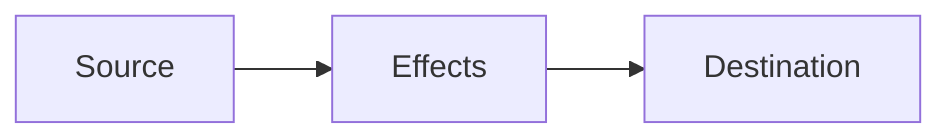
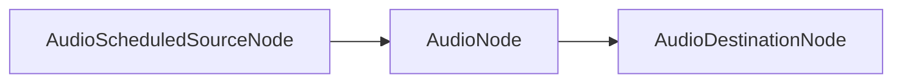

## Web Audio Introduction

##### HS23/24 - HKB - Laurens Inauen

---

### Course Materials

course materials are hosted on [Github](https://github.com/laurens-in/WebAudioIntroduction) to update run `git pull`

---

### Plan

|          |               |
| -------- | ------------- |
| 1st half | DOM API       |
| 2nd half | Web Audio API |

---

### DOM API

The DOM API is important to interact with the `html` on our page. We will need this to create interactive experiences.

---

### DOM API

We can grab references to elements using selectors:

```html
<button id="some-button" class="mute-buttons"></button>
```

```js
// grabs the first element of type button
let button = document.querySelector("button");

// grabs the first button of class mute-buttons
let button = document.querySelector(".mute-buttons");

// grabs the button with the id some-button
let button = document.querySelector("#some-button");

// grab all elements of type button
let buttons = document.querySelectorAll("button");

// grab all elements of class mute-buttons
let buttons = document.querySelectorAll(".mute-buttons");
```

---

### DOM API

These references expose some common properties of our elements:

```js
const someElement = document.querySelector("<some selector>");

someElement.id // string representing the id of the element
someElement.children // a list of references to the elements inside someElement
someElement.innerHTML // a string containing the HTML inside this element
```

These are common to all elements of all types, there are many more.

---

### DOM API

Some elements expose specific properties:

```js
const input = document.querySelector("input")

input.value // the value inside our input object as a string
input.valueAsNumber // the value inside our input as a number, NaN if conversion not possible

```

---

### DOM API

We can not only read these properties but also set them:

```js
const input = document.querySelector("input")

input.value = "hello";
```

---

### DOM API

We can listen to events on elements and react using callback functions:

```js
const button = document.querySelector("button");

button.addEventListener("click", () => {
  console.log("button clicked")
  }
)
```

---

### DOM API

The `addEventListener` method takes two arguments:

1. a string keyword specifying the type of event:

- "click"
- "change"
- "input"
- ...more

2. a callback function that will be executed whenever the event is triggered

---

### DOM API

The event listener will hand over the `Event` object as an argument to our callback function:

```js
const input = document.querySelector("input");

input.addEventListener("click", (e) => {
  console.log(e)
  }
)
```

---

### DOM API

The `Event` object has many properties, some of them are common others depend on the specific element.

---

### DOM API

A very important common property is the `e.target` which gives us a reference to the emitting element.

---

### DOM API

We can use this as follow:

```js
const input = document.querySelector("input");

input.addEventListener("change", (e) => console.log(e.target.value))
```

`e.target` references the input object itself, so we can read all its properties.

---

### DOM API

This might seem redundant, but it can be useful, since events "bubble up":

```js
const button = document.querySelector("button");

// triggers when the button is clicked
button.addEventListener("click", (e) => console.log(e.target.id));

// triggers when any click happens inside the whole page
document.addEventListener("click", 
  (e) => console.log("clicked inside document: ", e.target.id)
);
```

---

### DOM API

We can now dynamically change objects whenever someone interacts with our page:

```js
const button = document.querySelector("button");

let counter = 0;

button.addEventListener("click", (e) => {
  counter++;
  e.target.innerHTML = "i have been clicked " + counter + " times";
});
```

---

### Let's practice

You can do `exercise 2` now.

Update by running `git pull`.

---

### Web Audio API

---

### What is the Web Audio API?

The Web Audio API is a **Browser API** for playing and manipulating audio, which can incorporate:
- oscillators
- samples
- audio effects
- recording
- user interactions
- visualization

---

### A troubled past...

The Web Audio API is controversial in quite a few ways:
- some people disagree with the spec
- Chrome shipped some of their own spec without [proper review](https://github.com/WebAudio/web-audio-api/issues/248#issuecomment-740698581)
- there are some fundamental problems (scheduling, buffer-size, fft etc.)
	- some limits come from the browser
	- some limits come from the spec
- what is it? [who is it for? ](https://blog.mecheye.net/2017/09/i-dont-know-who-the-web-audio-api-is-designed-for/)

---

### What it isn't...

- collection of audio primitives (no `+`, no `*` etc.)
- a low-level audio framework, there's a lot of abstraction
- a high-level audio framework, there isn't a node for everything 

---

### What it feels like...

- a semi-random collection of functionality
- a mixed bag between some low-level and high-level functionality
- doesn't really know its target audience (people who use FMOD)

---

### Why should we care?

... why not just use "_insert library or tool name_"?

---

### Why should we care?

- WAAPI is a **browser API**, meaning browsers will continue to support it _FOREVER_. It will not change for the next 15 years. Backwards compatibility will always be guaranteed
- **third-party libraries**, like Tone.js, can disappear if their developers have no time to maintain them

---

### Why should we care?

- every library is based on Web Audio API -> if there's something not available to you in Tone.js, p5.sound, etc., these libraries include a way to add WAAPI functionality via custom nodes
- most libraries have a strong focus on traditional music, this isn't ideal for every use case
- for small projects p5.js or Tone.js can be overkill
- it is relatively simple and there are efforts to make [non-browser implementations](https://github.com/orottier/web-audio-api-rs)
- limitation can be good

---

### Basics: the audio graph



Node based graph with sources, effects and destinations.

---



---

![[threads.png]]

Runs in a separate thread, or else it could be blocked by the UI (main) thread. Every Node has an internal _native_ representation.

---

### Audio Context

```js
const ctx = new AudioContext();
```

- represents a graph
- is responsible for creating nodes
- is responsible for processing audio
- provides the audio destination: `ctx.destination`
- provides the current time: `ctx.currentTime`
- can only be started by user-interaction!

---

### AudioNode

Is the base interface for all audio nodes.

[details](https://developer.mozilla.org/en-US/docs/Web/API/AudioNode)

---

### AudioScheduledSourceNode

Is the base interface for all audio source nodes that can be scheduled.

[details](https://developer.mozilla.org/en-US/docs/Web/API/AudioScheduledSourceNode)

---

### Sources: Oscillator

```js
// create web audio api context
const ctx = new AudioContext();

// create OscillatorNode factory
const oscillator = ctx.createOscillator();

oscillator.type = "square";
oscillator.connect(ctx.destination);
oscillator.start();
// or if you wanna schedule it
oscillator.start(ctx.currentTime + 10)
```

Let's try it out

---

### Sources: Single-use

```js
const oscillator = ctx.createOscillator();
oscillator.start();
// --- a bit later
oscillator.stop();
// --- a bit later
oscillator.start();
```

This isn't possible. Sources are single-use. They are cheap to create and should/can not be reused.

---

### Effects: Gain

```js
const oscillator = ctx.createOscillator();
const gain = ctx.createGain();

oscilator.connect(gain);
gain.connect(ctx.destination);
```

---

### Adjusting: AudioParams

```js
const gain = ctx.createGain();
gain.gain.setValueAtTime(0, ctx.currentTime);

gain.gain.linearRampToValueAtTime(1, ctx.currentTime + 2);
gain.gain.linearRampToValueAtTime(0.5, ctx.currentTime + 3);
```

---

### Detour: Basic Operations

```js
// signals
const a = ctx.createOscillator();
const b = ctx.createOscillator();

// addition: a + b
const gain = ctx.createGain();
a.connect(gain);
b.connect(gain)

// subtraction: a - b
const gain = ctx.createGain();
const invert = ctx.createGain();
invert.gain.setValueAtTime(-1, ctx.currentTime);

a.connect(gain);
b.connect(inverter);
inverter.connect(gain);

// multiplication: a * b
const gain = ctx.createGain();
a.connect(gain);
b.connect(gain.gain);
```

---

### Let's do some exercises

Start with exercise 3 and finish exercise 3 & 4 before the next lesson.

