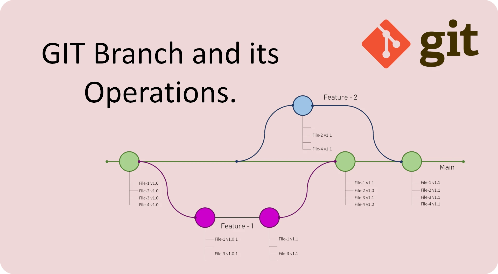

## Web Audio Introduction

##### FS26 - HKB - Laurens Inauen

---
  
### Lessons

| Date   | Time           |
| ------ | -------------- |
| 25.02. | 10:00 - 13:00  |
| 04.03. | 10:00 - 13:00  |
| 18.03. | 10:00 - 13:00  |
| 01.04. | 10:00 - 13:00  |
| 04.05. | 10:00 - 13:00  |


---

### Course Materials

course materials are written in [Markdown](https://commonmark.org/help/)

to get the most out of the course materials i recommend you use [Obsidian](https://obsidian.md/)

---

### About Me

- artist
  - BA sound arts
  - MA contemporary arts practice
  - algorithmic / generative music
  - web audio
  - rt60
- developer
  - BSc computer science
  - web developer

---

### About You

Please introduce yourself and tell the class:
- name, pronouns, field of study
- what kind of sound art you make
- what technology you usually use (i.e. Ableton, Max/MSP, PureData, etc.)
- any experience with web development
- what you hope to get out of this course

---

### Goal

creating web-based audio experiences.

---

### Goal

Each of you should create a little piece or instrument and show it in the last session.

---

### Why?

---

### Why?

- bring your art onto listeners' devices
  - web audio is the most accessible way for both artists and listeners
- create interactive pieces and experiences
  - modern browsers offer many possibilities to interact with listeners
- explore a (relatively) new and important medium artistically

---

### Why?

- be part of a young, enthusiastic and small community of artists
- learn to code
- skills are transferable to other forms of art
- make more meaningful statements about technology because you know what you're talking about

---

### Preconditions

- tool-chain, development environment
- knowledge of browser technologies
- knowledge of HTML, CSS, JavaScript
- knowledge of some libraries

without these we can't achieve our goal

---

1. web development is difficult and contains a lot of moving parts
2. web development is easy and each of you can learn with a bit of patience

---

### Disclaimer

We will go through a lot of stuff today. You don't need to understand everything right now. It will be like word salad.

---

### Goals For Today

- getting an overview over all the moving parts
- installing the necessary dependencies/software
- creating our first website :)

---

### Canvas: Overview

---

### Background Knowledge

#### How The Web Works

What is...
- the internet?
- the web?
- a server?
- a client?
- the browser?

---

### Canvas: Topology Of The Web

---

### Browser

- software we use to access the web
- takes an address and retrieves a website
- includes different engines for different purposes:
  - HTML rendering
  - JavaScript engine
  - Web Audio engine
  - many more...

---

### Website

A website is a bundle of files, composed of three types:

- HTML
- CSS
- JavaScript

Each of these have their own responsibility

---

### Website

- HTML defines the **structure**
- CSS defines the **appearance**
- JavaScript defines dynamic behavior and **interaction**

---

### Website

![[factory-3323978_1280.png]]

---

### HTML

XML based markup language that contains semantic elements to describe the document tree

```html
<body>
  <main>
    <h1>Hello World<h1>
    <p>HTML is pretty simple</p>
  </main>
</body>
```

---

### HTML

An element normally contains an opening and a closing tag, for example:

```html
<p> <!-- opening tag -->
  Hello world!
</p> <!-- closing tag -->
```

---

### HTML

Elements can have named attributes, for example:

```html
<div id="random-image" class="image-container">
   
</div>  
```

---

### HTML

some elements are void elements, meaning they can't contain further elements and have no closing tag:

```html

```

---

### CSS

- is a language for describing the appearance of HTML elements
- allows us to reference HTML elements using different selectors

---

### CSS

To style all elements of a specific type, we can reference them using their tag name:

```css
p {
  color: #fff123;
}
```

---

### CSS

To style all elements of a specific class, we use the `.` prefix and their class name:

```css
.image-container {
  width: 400px;
}
```

---

### CSS

To style a specific element, we can use the `#` prefix and their id name:

```css
#random-image {
  opacity: 0.5;
  height: 150px;
}
```

---

### CSS

In this course we will not bother too much with CSS

---

### JavaScript

- JavaScript is the programming language of the web
- before it was created, there were Java Applets and Adobe Flash
- before that, the web was completely static

---

### JavaScript

- just-in-time compiled scripting language
  - needs a runtime
- event-loop (useful for UI)
- asynchronous (useful for I/O)
- single-threaded
- multi-paradigm

...not great for audio

---

### Browser APIs

JavaScript alone is just a programming language, and has no capacity to change our HTML or make sound.

---

### Browser APIs

The browser exposes APIs that allow us to interact with native system parts.

---

### Detour: API

- stands for **Application Programming Interface**
- exposes JavaScript functions that interact with native components under the hood, e.g.:
  - manipulating HTML elements via DOM API
  - making sound via Web Audio API

---

### Detour: API


---

### Detour: API


---

### Example: DOM API

Allows us to reference HTML elements within JavaScript using CSS selectors:

```js
const image = document.querySelector("#random-image")
```

---

### How It Fits Together

HTML Boilerplate:

```html
<!DOCTYPE html>
<html lang="en">
  <head>
    <meta charset="UTF-8">
    <meta name="viewport" content="width=device-width, initial-scale=1.0">
    <title>name of your site</title>
    <!-- the following line links the style.css file -->
    <link rel="stylesheet" href="style.css">
  </head>
  <body>
    <!-- the following line links the index.js file -->
  	<script src="index.js"></script>
  </body>
</html>
```

---

### Adendum: Node.js

Node.js is a _server-side_ runtime for JavaScript:

- it runs JavaScript outside of the browser
- similar to the browser, it provides API to access native parts of your system:
  - file-system API
  - crypto API
- made it possible to write server and client code in JavaScript
- integrates a package manager to install libraries

---

### Adendum: Node.js

Because of Node.js the popularity and ecosystem of JavaScript exploded. Today people try to do everything with JavaScript, as noted by Atwood's Law:

> Any application that can be written in JavaScript, will eventually be written in JavaScript.

---

### Development

---

### Development Environment

we need:
- terminal
- code editor
- git
- npm

---

### Tools: Code Editor

go ahead and install a code editor of your choice.

I recommend [VSCode](https://code.visualstudio.com/) or [VSCodium](https://vscodium.com/).

---

### Tools: git

Git is a version control system for code. It allows us to track changes, create different branches and collaborate with others. It is also how most code is distributed and stored.

---

### Tools: git

#### Why do we need it?

- standard way to distribute and get code
- course materials are on Github
- it will help you in the long run

---

### Tools: git



---

### Tools: git

go ahead and install git.

- if you are using linux: `sudo apt install git`
- if you are using macOS I recommend you install it via [homebrew](https://brew.sh/): `brew install git`
- if you are using Windows I recommend using [WSL](https://learn.microsoft.com/en-us/windows/wsl/install)

---

### Tools: Node/npm

Node.js is a server-side JavaScript runtime. It comes with a package manager called `npm`. It will allow us to run a development server, install third party libraries and more.

There is a Node API for Max/MSP called [Node for Max](https://docs.cycling74.com/nodeformax/api/).

---

### Tools: Node/npm

#### Why do we need it?

- it will make your development process much easier
- it is an essential part of the Javascript ecosystem
- it will help you to build your code for deployment
- it is a standard software that every project is going to use
- it will help you in the long run

---

### Tools: Node/npm

go ahead and install Node/npm:

- if you are using linux: `sudo apt install node`
- if you are using macOS I recommend you install it via [homebrew](https://brew.sh/): `brew install node`
- if you are using Windows I recommend using [WSL](https://learn.microsoft.com/en-us/windows/wsl/install)

---

### Breakdown

What happens when we visit a website?

---

#### 1. Know What You Are Looking For

Every file on the web has a location, it can be accessed with a **Uniform Resource Locator** or **URL**:

| protocol | hostname                  | file       |
| -------- | ------------------------- | ---------- |
| https:// | docs.npmjs.com/about-npm/ | index.html |

Normally the entry point of a web-server is the `index.html` file.  Requesting `https://example.com` will return the `index.html`.

---

#### 2. Request The Resource

If we enter the **URL** in the address bar, the browser will make a GET request for the specified resource.

```sh
$ https GET docs.nmpjs.com/about-npm/index.html
```

---

#### 3. Receive Resource, Resolve Assets

We receive the requested `HTML` file form the server. The browser will render it and resolve all its resources, such as linked `CSS` or `JavaScript` files. This will repeat steps 2-3 for each asset.

---

### Let's try it!

---
